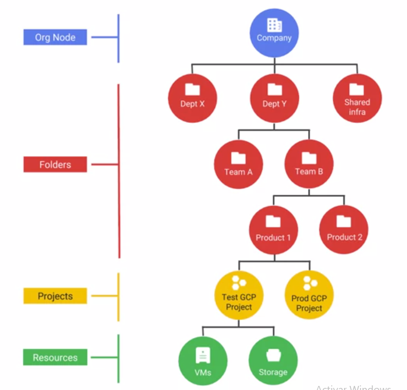
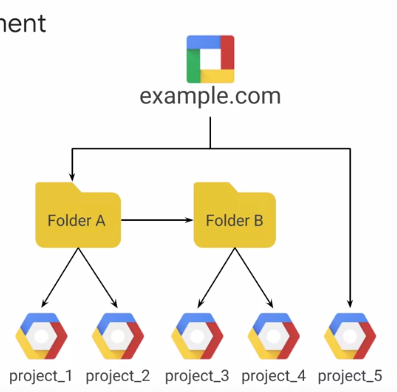

#resource hierarchy
Los recursos en GCP se organizan en **proyectos**. Estos a su vez, se pueden organizar en **carpetas**. Donde las carpetas peuden contener otras subcarpetas.
Las carpetas o los proyectos siempre pertenecen a un **nodo raiz**.  Para crear un **nodo de organizacion (raiz)** se asocia a su dominio de GSuite. De lo contrario, hayq ue usar Google Cloud Identity para crearlo.

Sistema de politicas **descendente**

Las politicas asignadas a una carpeta, son heredadas por los proyectos de dentro. Si queremos que dos proyectos o mas, tengan las mismas politicas, lo mejor sera crear una carpeta que los contenga.
Existen politicas a nivel de organizacion, a nivel de carpeta o a nivel de proyecto. Siempre se aplica la mas **generosa** (mas especifica)

Los recursos y apis se habilitan a **nivel de proyecto**.

Un proyecto se define por:
 - ID (unico)
 - nombre
 - numero de proyecto (unico) (asignado por Google)
 
 

 
 