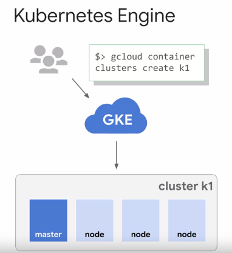

**Kubernetes** -> **Orquestador de contenedores** de codigo abierto para administrar y escalar apps. 
Tiene una API para controlar sus funcionalidades

**Cluster** -> Conjunto de nodos
**Nodo** -> Instancia (Maquina virtual de Compute Engine)

**Kubernetes Engine** -> Servicio administrado en la nube de Kubernetes

Kubernetes al desplegar contenedores, lo hace dentro de una abstraccion (wrapper) llamada **pod**.

**POD** -> Conjunto de uno o varios contenedores que trabajan juntos. 
Unidad mas pequeña desplegable en Kubernetes. Tiene una unica direccion IP. 

