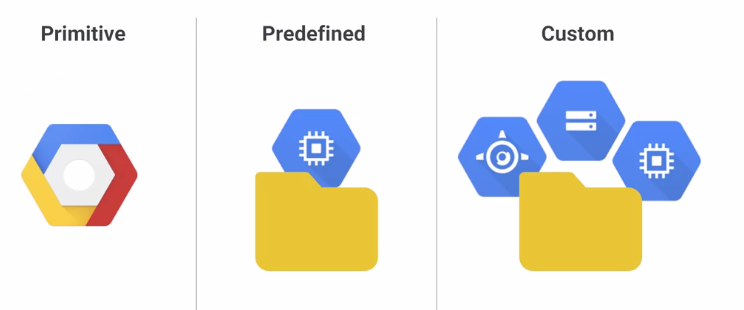
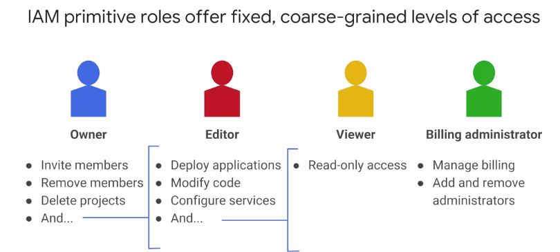
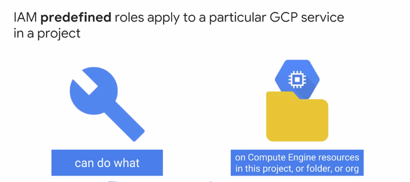

# IAM

Politica de IAM = Autorizacion nominativa de acciones sobre un recurso

Politica = Parte de **identificacion** + Parte de **acciones** permitidas + parte de identificacion del **recurso**

Parte de **identificacion** puede ser:
1. Cuenta de google
2. Grupo de google
3. Cuenta de servicio
4. Dominio de GSuite o Cloud Identity

Parte de **acciones** pueden ser:
1. Roles de IAM = conjunto de permisos

Existen 3 tipos de roles de IAM

1.Roles Primitivos -> afectan a todos los recursos del proyecto
> 

2.Roles Predefinidos -> afectan a Compute Engine, a nivel de proyecto, carpeta o recurso (para proyectos con datos confidenciales)
> 

