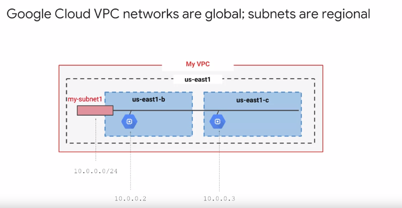

# VPC - Virtual Private Cloud Network

VPC = red que conecta los recursos de GCP entre si y a internet

Una VPC es **GLOBAL**. Puede contener subredes por **regiones** y dentro diferentes zonas. En cada zona, puedes tener recursos, como Compute Engines diferentes, con un rango de IP's. Las IP's asignadas, aunque se aumente el rango de direccioens IP's, no se ven afectadas.

## Capacidades
- Las VPC tienen tambien **tablas de enrutamiento** y un firewall, ambos transparentes.
- Una VPC pertenece a un proyecto GCP
- Podemos interconectar dos VPC's diferentes de dos proyectos diferentes entre si.

