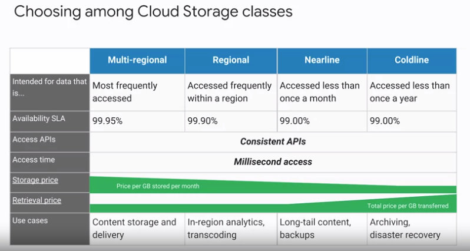
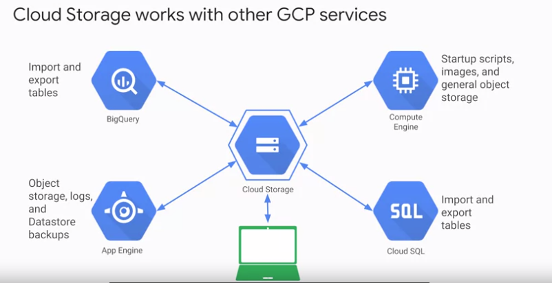

# Cloud Storage
Almacenamiento de **objetos** con acceso mediante clave **unica** mediante **URL**.

Objeto - URL

Almacenamiento de objetos que interactuan con tecnologias web.

***Caracteristicas:***
1. Sin prefijar tamaños de almacenamiento
2. Alta durabilidad
3. Se crean **buckets**(depositos) que guardan los objetos
4. Los objetos son **inmutables**, no se pueden editar.
5. Los objetos pueden tener un historico de versiones. Con muchas opciones: restauracion, purgas...
6. Se **encriptan** los datos por defecto.
7. Los objetos una vez guardados, se pueden mover a otras persistencias de GCP.
8. Los buckets y sus objetos, tienen **politica de accesos** (IAM por defecto)
9. Se pueden crear **ACL** (lista de control de accesos) para mas grano fino.
10. Cada ACL consta de dos datos: **alcance** (scope)(quien) + **permiso** (que puede hacer)

Existen 4 tipos de clases de Cloud Storage:

Podemos llevar datos a Cloud Storage desde otros recursos de GCP:

